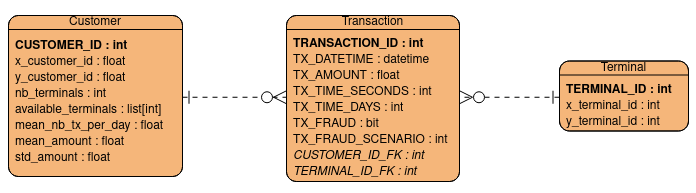
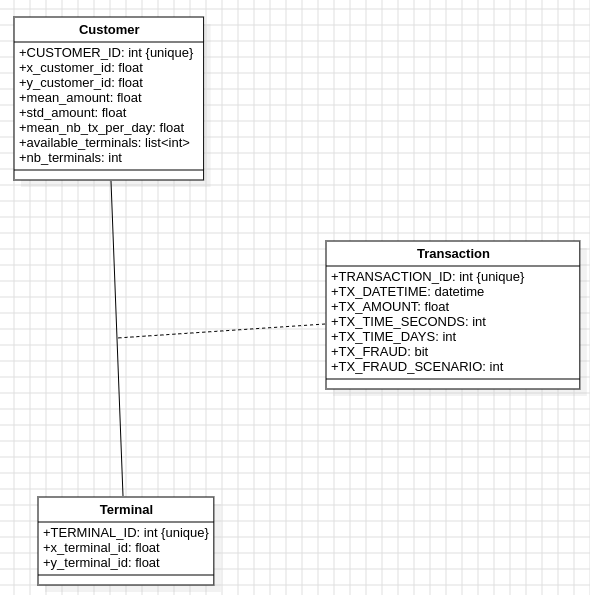
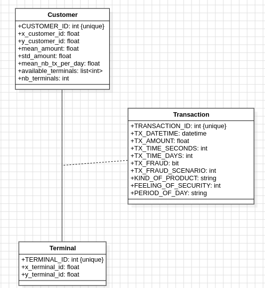

Masolini Pietro - Universita' degli Studi di Milano - 2024 - [Github](https://github.com/roccobaloccoo)

<hr>

# [New Generation DBMS Project](https://github.com/roccobalocco/NewDBMSProject) 2023/2024:

For the realization of this project I have chosen to use Neo4J. The choice of a Graph Database is due to the importance of relationships in the dataset and the specific operations that are required.

## Models:

The simulator generate three different tables:

- **Customer**, that doesn't hold any classical information (like the name, surname, etc) about the person that it represents. Instead, it describe the customer with a *unique identifier*, *geographical location*, *spending frequency* and  *spending amounts*
- **Terminal**, that holds only the information about his *geographical location*
- **Transaction**, that connects a **Customer** and **Terminal**, holding the information about the buying action. It contains contains the *customer identifier*, *terminal identifier*, *amount of the transaction*, *date of the transaction* and an optional field that marks a **Transaction** as *fraudulent*

### Conceptual Model:

The conceptual model is straightforward; it lists the three entities as they appear in the dataset, connecting them via one-to-many relationships.

A **Customer** can make many **Transactions**, and each **Transaction** refers to one **Terminal**.


### Logical Model:

it defines the structure of the dataset, maintaining the initial columns as proposed by the simulator.


### Physical Model:

It enhances the logical model by specifying data types, primary keys, and foreign keys. This detailed schema ensures that the database can be efficiently implemented and queried.



### UML Class Diagram:

The **Transaction** entity has been transformed into an *association class* because it doesn't exists by itself, but it only exists if binded with both **Customer** and **Terminal**. 



Considering the operations that will extend our entities, the class diagram has been updated to include three new properties in **Transaction**:

- `KIND_OF_PRODUCT`
- `FEELING_OF_SECURITY`
- `PERIOD_OF_DAY`



## Neo4J:

Starting from the latest UML Class Diagram, the nodes and relationships in Neo4j reflect its structure perfectly. In the database, we will have the following Nodes:

- `Customer`, with all the properties listed in the diagram
- `Terminal`, with all the properties listed in the diagram

And the following Relationships:

- `Transaction`, which starts from a `Customer` and a ends to a `Terminal`, with the same properties listed in the diagram
-  `Buying_friends`, which connects two `Customer` without any properties

Moreover, operations require identifying a special relationship between `Customers` called the `Co-customer` relationship. This relationship will be available on demand, so it won't be stored in the database but will be computed as needed.

### Consideration and constraints:

#### Consideration:

I haven't changed the initial dataset in term of properties or data structures. Given the operations that were required and the chose NoSQL database, there weren't particular changes that were "mandatory" or "game changing".

About the operation, I have to clarify my interpretation for each of them:

1. Operation **a**:

   > For each customer checks that the spending frequency and the spending amounts of the last month is under the usual spending frequency and the spending amounts for the same period.

   Interpretation 1:

   - Identify customers whose spending frequency and amounts in the last month are below the average for that period (*period*: the same starting day/month and ending day/month over the years)
   - The average is calculated across all customers in the database, not individually for each customer.

   Interpretation 2:

   - The average transaction amount is the `mean_amount` property, while for the frequency I utilize `mean_nb_tx_per_day` multiplied by the days in the considered period

2. Operation **b**:

   > For each terminal identify the possible fraudulent transactions. The fraudulent transactions are those whose import is higher than 20% of the maximal import of the transactions executed on the same terminal in the last month.


   Interpretation:

   - Retrieve transactions whose amount is **greater than 120% of the highest transaction amount** on the same  terminal in the last month.

3. Operation **e**:

   > For each period of the day identifies the number of transactions that occurred in that period,
   > and the average number of fraudulent transactions.

   Interpretation:
   
   - Use the `TX_FRAUD` property to identify fraudulent transactions.
   - Count transactions and calculate the average number of fraudulent transactions for defined periods of the day.

#### Constraints and Assumptions:

- I assumed that the transactions marked as fraudulent are genuinely fraudulent as per the definition in operation **b**.
- I assumed hat the values stored in the customer nodes about the *averages*, *number of terminals*, etc are correct.
- I assumed that in the generated datasets there are no duplication.
- I am using the identifiers provided by the datasets for comparing nodes when I need to find a specific one, but I haven't replaced the default node identifier provided by Neo4j.
- I have extended the data as stated in the operation **d** and I have choose to implement the extensions as described below:
  - *Period of the day* defined *morning* between 6 and 12, *afternoon* between 12 and 18, *evening* between 18 and 24 and *night* between 24 and 6
  - *Kind of products* assigned using a generator based on a modulo 5 operations on `TRANSACTION_ID` to assign  the values
  - *Feeling of security* assigned using the `rand` function provided by Neo4J
- The *co-customer* relationship from operation **c** is not stored in the database due to the variability in its implementation.

## Generation scripts:

This script, stripped of imports and function definitions, shows how I generate datasets.

I use a `dict` (`args_num`) to store the different amount of customers, terminals and days for each of the dataset required, ensuring the meet size constraints.

Next, I exploit functions given [by the website linked in the project]( fraud-
detection-handbook.github.io/fraud-detection-handbook/Chapter_3_GettingStarted/SimulatedDataset.html) to create dataframes. These dataframes are then converted into `csv` files, with transaction data spanning three years, starting from starting from *2018-04-01*.

Based on the dictionary key. I select the the directory where the `csv` files will be stored and exploit pandas function `to_csv` to save them.

The final step consists into passing through a function that clears the `csv` from the useless indexes and save the files. This step that can be replaced by using by the option in the `to_csv` function (`Index=False`).

```python
args_num:dict = {0: [1150, 100, 1095], 1: [2300, 200, 1095], 2: [6300, 800, 1095]}

for key, value in args_num.items():
    # Generare dataset for the three tables
    (customer_profiles_table, terminal_profiles_table, transactions_df)=\
        generate_dataset(n_customers = value[0], 
                        n_terminals = value[1], 
                        nb_days= value[2], 
                        start_date="2018-04-01", 
                        r=5)
    # Add frauds to transactions
    transactions_df = add_frauds(customer_profiles_table, terminal_profiles_table, transactions_df)

    # Saving of dataset
    DIR_OUTPUT = "./simulated-data-raw"
    if key == 0:
        DIR_OUTPUT += '-50mb/'
    elif key == 1:
        DIR_OUTPUT += '-100mb/'
    else: 
        DIR_OUTPUT += '-200mb/'

    create_dir(DIR_OUTPUT)

    # saving customers
    customer_profiles_table.to_csv(DIR_OUTPUT + '/customers.csv', sep=';', encoding='utf-8')
    clean_csv(DIR_OUTPUT + '/customers.csv')
    # saving terminals   
    terminal_profiles_table.to_csv(DIR_OUTPUT + '/terminals.csv', sep=';', encoding='utf-8')
    clean_csv(DIR_OUTPUT + '/terminals.csv')
    # saving transactions:
    transactions_df.to_csv(DIR_OUTPUT + '/transactions.csv', sep=';', encoding='utf-8')
    clean_csv(DIR_OUTPUT + '/transactions.csv')
```

## Loading scripts:

To have an overview about the loading scripts I have included some pieces of the main one below.

The loading process involves different techniques:

- For *customers and terminals* I utilize Neo4j's native functionality, which allows users to import nodes using a csv file hosted somewhere (in my case, Google Sheets publication).
  Users need to upload theri CSV files to Google Drive (or using the import function without the flag *convert*) and then publish them online as `csv`. 
  Because of the relative modest size of these `csv` files I have not considered using APOC.
- For the *transactions* I have implemented three ways and all of them involves the use of threads. I haven't used Google Drive because with my choice of parameters this `csv` is too huge to handle.
  - **Uploading row by row**, this process, while slow, allows for parallel execution using threads to mitigate some of the slowness.
    However, due to the three-year period in which transactions can occur, the resulting file size can be too large for Google Drive to handle.
  - **Convert the creation into a cypher script**, this method permit to generate the creation operations and store them into a single file to then decide what to do.
    It also involves thread, but not this much as the first method, for each thread I create a temporary file, when all of them have finished the execution I merge all these files into a single one.
  - **Exploiting the creation scripts with APOC**, this method permit to use the `cql` files previously created to generate a database call with the APOC method `runMany`, that permits the execution of multiple statements on a single query even if I am not using the Neo4j browser.
    This approach significantly enhances import performance.

```python
conn = neo.Neo()

csv_links = [
    'https://docs.google.com/customerCSV', 
    'https://docs.google.com/terminalCSV',  
]

conn.import_csv(csv_links[0], neo.FileType.CUSTOMERS)
conn.import_csv(csv_links[1], neo.FileType.TERMINALS)

def relationship_creator(rel_lines:list[str],i:int):
    # implementation
def relationship_saver(rel_lines:list[str],i:int):
    # implementation
def file_merger(file_extension:str):
    # implementation
def run_many(path:str):
	# implementation


def file_opener(file_name):
    """Opens a file and processes its contents in different ways depending on the function called inside it.
    It can exploit the @relationship_creator, @relationship_saver, @run_many, and @file_merger functions.

    Args:
        file_name (str): The name of the file to be opened (the relative path usually).

    Raises:
        Exception: If an error occurs while processing the file.

    Returns:
        None
    """
    with open(file_name, 'r') as file:
        try:
            threadNum = 2000
            lines = file.readlines()[1:] # Discard the header
            lineCount = len(lines)
            rowPerThread = lineCount // threadNum
            print('Starting to read the line of {file}, preparing {numRel} relationships'.format(file=file_name, numRel=lineCount))

            # Thread section:
            list_splitter = [i * rowPerThread for i in range(1, threadNum)]
            threads = []

            for i in range (1, threadNum):
                # To save on the db really slow
                # thread = threading.Thread(target=relationship_creator, args=(lines[list_splitter[i-1]:list_splitter[i]],i,))
                # To save into cql files using threads
                thread = threading.Thread(target=relationship_saver, args=(lines[list_splitter[i-1]:list_splitter[i]],i,))
                
                threads.append(thread)
                thread.start()

            for thread in threads:
                thread.join()
            
            threads = []
            # To merge all the generated files into a single one
            # file_merger('.cql')
            # To execute the multiple statements from the file in a single query with a number of threads that reflects the number of files
            for i in range (1, threadNum):
                arg = f'../simulated-data-raw-200mb/transactionsThread{i}.cql'
                thread = threading.Thread(target=run_many, args=(arg,))
                threads.append(thread)
                time.sleep(25) # It depends on the heap size of your db

            for thread in threads:
                thread.join()
        except Exception as e:
            print(f'Something wrong happened - \n {e}')

file_opener('../simulated-data-raw-50mb/transactions.csv')

conn.close()
```

The `import_csv` is implemented within the `Neo` class, which manages all operations and database connections. This method simplifies the creation of statements to be executed into the database.

One notable features is Neo4j's native support for converting a wide range of data types.

```python
def import_csv(self, filepath:str, fileType: FileType):
        """ Imports the csv file at the given path into the database, the importation depends on the fileType given
        
            Args:
                filepath(str): the path of the file to import
                fileType(FileType): the type of the file to import
    
            Returns:
                None
        """
        create_statement = ''
        match fileType:
            case FileType.CUSTOMERS:
                create_statement = """
                CREATE (:Customer {
                    CUSTOMER_ID: toInteger(line.CUSTOMER_ID),
                    x_customer_id: toFloat(line.x_customer_id),
                    y_customer_id: toFloat(line.y_customer_id),
                    mean_amount: toFloat(line.mean_amount),
                    std_amount: toFloat(line.std_amount),
                    mean_nb_tx_per_day: toFloat(line.mean_nb_tx_per_day),
                    available_terminals: line.available_terminals,
                    nb_terminals: toInteger(line.nb_terminals)
                })
                """
            case FileType.TERMINALS:
                create_statement = """
                CREATE (:Terminal {
                    TERMINAL_ID: toInteger(line.TERMINAL_ID),
                    x_terminal_id: toFloat(line.x_terminal_id),
                    y_terminal_id: toFloat(line.y_terminal_id)
                })
                """
            case _:
                raise ValueError('Invalid file type')
        
        query = f"""
        LOAD CSV WITH HEADERS FROM '{filepath}' AS line
        {create_statement}
        """

        # Define metadata if any (this is optional)
        metadata = {
            "purpose": "Importing csv file"
        }

        # Create the Query object
        neo4j_query = Query(text=query, metadata=metadata) #type: ignore

        self.driver.execute_query(neo4j_query)
```

The `relationship_saver` function constructs a statement for creating a relationship in Neo4J and then exploit the `free_query` function to execute that statement.

Execution is sequential because multiple statements cannot be executed simultaneously outside the Neo4J browser without APOC. The use of threading can mitigate this limitation.	

```python
def relationship_creator(rel_lines:list[str],i:int):
    print("Starting thread {i}".format(i=i))
    for line in rel_lines:
        columns = line.split(';')
        statement = f"""
        MATCH (cc:Customer {{CUSTOMER_ID: {columns[3]}}}), (tt:Terminal {{TERMINAL_ID: {columns[4]}}})
        CREATE (cc) -[tr:Transaction {{
            TRANSACTION_ID: toInteger({columns[0]}),
            TX_DATETIME:  datetime({{epochMillis: apoc.date.parse('{columns[6]}', 'ms', 'yyyy-MM-dd HH:mm:ss')}}),
            TX_AMOUNT: toFloat({columns[5]}),
            TX_TIME_SECONDS: toInteger({columns[1]}),
            TX_TIME_DAYS: toInteger({columns[2]}),
            TX_FRAUD: toBoolean({columns[7]}),
            TX_FRAUD_SCENARIO: toInteger({columns[8]})}}]-> (tt);
        """
        # This is inside the for because appareantly the free tier has some issues concatenating create statements of this kind....
        # It takes a lot of time, really a lot. But my pc have also free time when I am sleeping
        # Define metadata if any (this is optional)
        metadata = {
            "purpose": "Importing transaction from a list into the database"
        }

        # Create the Query object
        neo4j_query = Query(text=statement, metadata=metadata) #type: ignore

        conn.free_query_single(neo4j_query)
    print("Ending thread {i}".format(i=i))
```

The `relationship_saver` is a better version of the previous one, in term of performance and in term of query construction; it saves the statements into a file called `transactionsThreadNum.cql` that would be utilize by the `run_many` function.

The step of creating a file isn't necessary, but it can be nice to have if our relationships number is huge and we want to have a backup of our creation statement.

This function utilizes the `MERGE` keyboard for the construction of the relationship and also check if it already exists in our database. Due to the heap size limit of Neo4j desktop db, some crashes happened, with the check of existence I had the possibility to recover at some point without worrying about duplication.

```python
def relationship_saver(rel_lines:list[str],i:int):
    print("Starting thread {i}".format(i=i))
    statements = ''  # Initialize the statements variable
    
    for line in rel_lines:
        columns = line.split(',')
        statements += f"""MERGE (cc:Customer {{CUSTOMER_ID: {columns[2]}}})-[tr:Transaction {{TRANSACTION_ID: {columns[0]}}}]->(tt:Terminal {{TERMINAL_ID: {columns[3]}}}) ON CREATE SET tr.TRANSACTION_ID = {columns[0]}, tr.TX_DATETIME = datetime({{epochMillis: apoc.date.parse('{columns[1]}', 'ms', 'yyyy-MM-dd HH:mm:ss')}}), tr.TX_AMOUNT = toFloat({columns[4]}), tr.TX_TIME_SECONDS = {columns[5]}, tr.TX_TIME_DAYS = {columns[6]},tr.TX_FRAUD = toBoolean({columns[7]}),tr.TX_FRAUD_SCENARIO = {columns[8]} RETURN 'ok';
        """
    file_path = f"../simulated-data-raw-200mb/transactionsThread{i}.cql"
    # Open the file in write mode
    with open(file_path, 'w') as file:
        # Write content to the file
        file.write(statements)
        file.close()
    print("Ending thread {i}".format(i=i))
```

The `run_many` function simply open the given file at the given path and read all of its lines, then it builds the Neo4j statement exploiting the APOC function `runMany` without specifying a `Map` of params because the construction of the statements puts in it the right values. At the end the file is removed.

```python
def run_many(path:str):
    print(f"Starting to run the file {path}")
    with open(path, 'r') as file:
        lines = file.read()
        query = f'''
            CALL apoc.cypher.runMany(
            "{lines}",
            {{}}
        );'''
        # Define metadata if any (this is optional)
        metadata = {
            "purpose": "Importing transactions from a file into the database."
        }

        # Create the Query object
        neo4j_query = Query(text=query, metadata=metadata) #type: ignore

        conn.free_query(neo4j_query)
        file.close()

    print(f"Ending to run the file {path}")
    os.remove(path)
```

## Operation scripts:

I have included all the required operations within a class called `Neo`, that also includes the connection to the database, the disconnection and two method to execute unspecified statement inside Neo4J. This approach exploits the environment variables to avoid hard-coding the sensible informations.

The `free_query` method executes an arbitrary statement to then put the results inside a DataFrame, bye default the result would be obtained by the `free_query_single` to then return a DataFrame, this because some of the queries return statement; this data structure is easily manipulable and also avoid us the creation of $n$ data structure to contain the results of the requested operations. Additionally, `free_query_single` serves as a shortcut to the `single()` method provided by `neo4j` library, for the statement returning a single result.

All the methods in this class includes documentation, that can be easily transformed into `.md` file with [this simple script](https://github.com/roccobalocco/MD_Doc_Gen).

```python
class Neo:

    def __init__(self):
        """ Open a connection on a Neo4j instance using parameters from the environment variables:
            - NEO_URI: the uri of the neo4j instance
            - NEO_USER: the username of the neo4j instance
            - NEO_PSW: the password of the neo4j instance
        """
        try:
            print('Trying to open a connection with neo4j')
            self.driver = GraphDatabase.driver(os.environ['NEO_URI'], auth=(os.environ['NEO_USER'], os.environ['NEO_PSW']))
            print('Connection with neo4j opened')
        except:
            print('Could not open connection with neo4j')
            
    def close(self):
        """ Close the connection on Neo4j instance if it is open
        """
        print('Closing connection with neo4j')
        self.driver.close()
    
    def free_query(self, query: te.LiteralString | Query, directToDF:bool = False) -> DataFrame:
        """ Execute the statement passed as an argument and  return the result as a dataframe
        
            Args:
                query(te.LiteralString | Query): statement to be executed
                directToDF(bool): if True the result will be returned as a dataframe, otherwise it will be processed into a dataframe
    
            Returns:
                A dataframe representing the result of the statement
        """
        
        if(directToDF):
            pandas_df = self.driver.execute_query(
                query,
                result_transformer_=neo4j.Result.to_df,
            )
        else:
            result = self.free_query_single(query)
            pandas_df = DataFrame(result)
        return pandas_df  
        
    def free_query_single(self, query:te.LiteralString | Query):
        """ Execute the statement passed as an argument and return the result as single result
        
            Args:
                query(te.LiteralString | Query): statement to be executed
    
            Returns:
                A single result
        """
        single_result = self.driver.execute_query(query)
        records = single_result.records

        return records[0][single_result.keys[0]]
    
    def import_csv(self, filepath:str, fileType: FileType):
        # Implementation
   
    # Operation a:
    def get_customer_under_average_with_properties(self, dt_start: datetime, dt_end: datetime)-> DataFrame:
    	# Implementation
        
    def get_customer_under_average(self, dt_start: datetime, dt_end: datetime)-> DataFrame:
		# Implementation
    
    def get_period_average_spending_amounts(self, dt_start:date, dt_end:date)-> float:
		# Implementation
    
    def get_period_average_spending_frequency(self, dt_start:date, dt_end:date)-> float:
		# Implementation
    
    # Operation b:
    def get_fraudolent_transactions(self, terminal_id:str, dt_start:date, dt_end:date)-> DataFrame:
    	# Implementation
    
    def get_terminal_max_import_last_month(self, terminal_id:str, dt_start:date, dt_end:date)-> float:
    	# Implementation
        
	# Operation c:
    def get_co_customer_relationships_of_degree_k(self, u:int, k:int)-> DataFrame:
    	# Implementation
        
    # Operation d:
    def extend_neo(self)-> None:
    	# Implementation
    
    def extend_neo_with_period(self)-> None:
    	# Implementation
    
    def extend_neo_with_kind_of_product(self)-> None:
    	# Implementation
    
    def extend_neo_with_feeling_of_security(self)-> None:
    	# Implementation
    
    def connect_buying_friends(self)-> None:
    	# Implementation
        
	# Operation e:
    
    def get_transactions_per_period(self, dt_start: date, dt_end: date)-> DataFrame:
    	# Implementation
    
    def get_fraudolent_transactions_per_period(self, dt_start: date, dt_end: date)-> DataFrame:
    	# Implementation
    
```

### Operation a:

> For each customer checks that the spending frequency and the spending amounts of the last month is under the usual spending frequency and the spending amounts for the same period.

To achieve this, I have developed two side methods to retrieve the *average spending amount* and *average spending frequency* of a period. The entire operation was extended to an arbitrary period of time instead of the last month.

Once calculated the two averages I use them into the main query to retrieve all the Customers that are under the average of spending amount and average of spending frequency.

Here can be seen the utility provided by the `free_query_single`, who assumes that the statement given in input returns a single row of result and a single key, using `records[0][single_result.keys[0]]` to return the expected result.

In the operations description above I have listed two interpretation:

1. The first one is covered by `get_customer_under_average` method
2. The second one is covered by `get_customer_under_average_with_properties` method

Both methods exploit the utilities provided, the only thing that changes is the main query wihin them.

```python
def get_customer_under_average(self, dt_start: datetime, dt_end: datetime)-> DataFrame:
        """ Get customer under average for spending amounts and frequency of spending between dt_start and dt_end, 
            by comparing them to the average of this period
            (considering period as the same day&month over all the years registered in the database)
        
            Args:
                dt_start(datetime): date that states the start of the period to take in account 
                dt_end(datetime): date that states the end of the period to take in account
    
            Returns:
                A dataframe representing all the customers that have their amounts and frequency of spending in the period in this year 
                less than the average of this period all over the years
        """
        avg_spending_amount = self.get_period_average_spending_amounts(dt_start, dt_end)
        avg_spending_frequency = self.get_period_average_spending_frequency(dt_start, dt_end)

        # Define the query text
        query = f"""
        MATCH (c:Customer)  -[t:Transaction]-> (:Terminal)
        WHERE t.TX_DATETIME >= '{dt_start}' 
        AND 
        t.TX_DATETIME <= '{dt_end}'
        WITH c, AVG(t.TX_AMOUNT) as avg_amount, COUNT(t) as nb_tx
        WHERE avg_amount < {avg_spending_amount} AND nb_tx < {avg_spending_frequency}
        RETURN collect(c) as customers
        """

        # Define metadata if any (this is optional)
        metadata = {
            "purpose": "Retrieve customers with low spending and transaction frequency"
        }

        # Create the Query object
        neo4j_query = Query(text=query, metadata=metadata) #type: ignore

        customers = self.free_query(neo4j_query)
        return customers
    def get_period_average_spending_amounts(self, dt_start:date, dt_end:date)-> float:
        """ Get the average of spending amounts in a given period between dt_start and dt_end for all the years in the database
            
            Args:
                dt_start(datetime): date that states the start of the period to take in account (not consider the year)
                dt_end(datetime): date that states the end of the period to take in account (not consider the year) 
    
            Returns:
                A float stating the spending average in the period
        """
        query = f"""
        MATCH ()-[t:Transaction]->(:Terminal)
        WHERE 
            t.TX_DATETIME.month >= {dt_start.month} 
            AND 
            t.TX_DATETIME.day >= {dt_start.day}
            AND 
            t.TX_DATETIME.month <= {dt_end.month} 
            AND
            t.TX_DATETIME.day <= {dt_end.day}
        RETURN AVG(t.TX_AMOUNT) as avg_spending_amount
        """

        # Define metadata if any (this is optional)
        metadata = {
            "purpose": "Retrieve the average spending amount in a given period between dt_start and dt_end for all the years in the database"
        }

        # Create the Query object
        neo4j_query = Query(text=query, metadata=metadata) #type: ignore

        avg_spending_amount = self.free_query_single(neo4j_query)
        if (avg_spending_amount is None):
            return 0.
        return float(avg_spending_amount)
    
    def get_period_average_spending_frequency(self, dt_start:date, dt_end:date)-> float:
        """ Get the average of spending frequency in a given period between dt_start and dt_end for all the years in the database
            Args:
                dt_start(datetime): date that states the start of the period to take in account (not consider the year)
                dt_end(datetime): date that states the end of the period to take in account (not consider the year) 
    
            Returns:
                A float stating the spending frequency in the period
        """
        query = f"""
        MATCH (c:Customer)-[t:Transaction]->(:Terminal)
        WHERE
        t.TX_DATETIME.month >= {dt_start.month}
        AND 
        t.TX_DATETIME.day >= {dt_start.day}
        AND 
        t.TX_DATETIME.month <= {dt_end.month}
        AND 
        t.TX_DATETIME.day <= {dt_end.day}
        WITH COUNT(t) as transaction_number, COUNT(DISTINCT c) as customer_number
        WHERE customer_number > 0
        RETURN transaction_number*1.0/customer_number as avg_spending_frequency
        """

        # Define metadata if any (this is optional)
        metadata = {
            "purpose": "Retrieve the average spending frequency in a given period between dt_start and dt_end for all the years in the database"
        }

        # Create the Query object
        neo4j_query = Query(text=query, metadata=metadata) #type: ignore

        avg_spending_frequency  = self.free_query_single(neo4j_query)

        if (avg_spending_frequency is None):
            return 0.
        return float(avg_spending_frequency)  # type: ignore
```

### Operation b:

> For each terminal identify the possible fraudulent transactions. 
>
> The fraudulent transactions are those whose import is higher than 20% of the maximal import of the transactions executed on the same terminal in the last month.

For this operation I have realized a supporting method called `get_terminal_max_import_last_month` that retrieves the maximum import on a given terminal in a given period (extended beyond just the last month).

Once retrieved the maximal import of the period I compute the 120% of this value, to then use it inside the main query, that identifies all the fraudulent transitions based on the comparison of this amount with each amount of the transactions.

```python
def get_fraudolent_transactions(self, terminal_id:str, dt_start:date, dt_end:date)-> DataFrame:
        """ Get all the fraudolent transactions that have an import higher than 20% 
            of the maximal import of the transactions executed on the same terminal in the last month
            
            Returns:
                A dataframe of transactions that are considered fraudolent.
        """
        maximal_import = self.get_terminal_max_import_last_month(terminal_id, dt_start, dt_end)
        maximal_import_20 = maximal_import + (maximal_import * 0.2)
        query = f"""
        MATCH (:Terminal {{TERMINAL_ID: {terminal_id}}}) -[t:Transaction]- ()
        WHERE t.TX_AMOUNT >= {maximal_import_20}
        RETURN collect(t) as fraudolent_transactions
        """

        # Define metadata if any (this is optional)
        metadata = {
            "purpose": "Retrieve fraudolent transactions with an import higher than 20percent of the maximal import of the transactions executed on the same terminal in the last month"
        }

        # Create the Query object
        neo4j_query = Query(text=query, metadata=metadata) #type: ignore

        fraudolent_transactions = self.free_query(neo4j_query)
        return fraudolent_transactions
    def get_terminal_max_import_last_month(self, terminal_id:str, dt_start:date, dt_end:date)-> float:
        """ Get the maximal import of the transactions executed on the terminal terminal_id in the last month
            
            Args:
                terminal_id(int): the id of the terminal to consider
                dt_start(datetime): date that states the start of the period to take in account
                dt_end(datetime): date that states the end of the period to take in account 
    
            Returns:
                A float representing the maximal import of the transactions executed on the terminal terminal_id in the last month
        """
        query = f"""
        MATCH (t:Terminal {{TERMINAL_ID: {terminal_id}}}) <-[tr:Transaction]- (:Customer)
        WHERE 
        tr.TX_DATETIME >= datetime({{epochMillis: apoc.date.parse('{dt_start}', 'ms', 'yyyy-MM-dd HH:mm:ss')}})
        AND 
        tr.TX_DATETIME <= datetime({{epochMillis: apoc.date.parse('{dt_end}', 'ms', 'yyyy-MM-dd HH:mm:ss')}})
        RETURN MAX(tr.TX_AMOUNT) as max_import
        """
        
        # Define metadata if any (this is optional)
        metadata = {
            "purpose": "Retrieve the maximal import of the transactions executed on the terminal terminal_id in the last month"
        }

        # Create the Query object
        neo4j_query = Query(text=query, metadata=metadata) #type: ignore

        maximal_import = self.free_query_single(neo4j_query)
        if (maximal_import is None):
            return 0.
        return float(maximal_import)
```
### Operation c:

> Retrieve the *co-customer relationships* of degree $k$

This method embeds the request; it takes the user id (`u`) and the degree of the relationship (`k`) in input to then return a DataFrame with the collection of distinct customers that are categorized as *co-customer*  of degree $k$.  

```python
def get_co_customer_relationships_of_degree_k(self, u:int, k:int)-> DataFrame:
        """ Get the co-customer-relationships of degree k for the user u
            
            Args:
                u(int): the id of the user to consider
                k(int): the degree of the co-customer-relationships
    
            Returns:
                A dataframe of the users that have a co-customer-relationship of degree k with the user u
        """
        query = f"""
        MATCH (c:Customer {{CUSTOMER_ID: {u}}}) -[:Transaction*{k}]- (co:Customer)
        WHERE c <> co
        RETURN collect(DISTINCT co) as co_customers
        """

        # Define metadata if any (this is optional)
        metadata = {
            "purpose": "Retrieve the co-customer-relationships of degree k for the user u"
        }

        # Create the Query object
        neo4j_query = Query(text=query, metadata=metadata) #type: ignore

        co_customers = self.free_query(neo4j_query)
        return co_customers
```
### Operation d:

This operation is divided in four methods, called all at once with `extend_neo` that are executed sequentially.

> The period of the day {morning, afternoon, evening, night} in which the transaction has been executed.

`extend_neo_with_period` assigns a *period of time* by comparing the hour of execution of the transition.

> The kind of products that have been bought through the transaction {high-tech, food, clothing, consumable, other}

`extend_neo_with_kind_of_product` assigns a type of product based on the modulo five of `TERMINAL_ID`.

> The feeling of security expressed by the user. This is an integer value between 1 and 5 expressed by the user when conclude the transaction.

`extend_neo_with_feeling_of_security` assigns a value for feeling of security based on the `rand()` function provided by Neo4j.

> Customers that make more than three transactions from the same terminal expressing a similar average feeling of security should be connected as “buying_friends”. Therefore also this kind of relationship should be explicitly stored in the NOSQL database and can be queried. Note, two average feelings of security are considered similar when their difference is lower than 1.

`connect_buying_friends` is a method that connect Customers with the *buying_friends* relationship if they both have at least four transactions on the same terminal that express a similar average of feeling of security (the difference between the averages should be lower than one).

The relationships are saved into the database to let users query whenever they want.

It is important to notice that the first three call into the `extend_neo` method can be parallelized, but the fourth call must happened after the `extend_neo_with_period` finishes, because it utilize the `PERIOD_OF_DAY` property.

```python
def extend_neo(self)-> None:
        """ Extend the logical model that you have stored in the NOSQL database by introducing the following information:
            Each transaction should be extended with:
                - The period of the day {morning, afternoon, evening, night} in which the transaction has been executed.
                - The kind of products that have been bought through the transaction {high-tech, food, clothing, consumable, other}
                - The feeling of security expressed by the user. This is an integer value between 1 and 5 expressed by the user when conclude the transaction.
                    The values can be chosen randomly.
            Customers that make more than three transactions from the same terminal expressing a similar average feeling of security should be connected as “buying_friends”.
            Therefore also this kind of relationship should be explicitly stored in the NOSQL database and can be queried. 
            Note, two average feelings of security are considered similar when their difference is lower than 1.
        """
        self.extend_neo_with_period()
        self.extend_neo_with_kind_of_product()
        self.extend_neo_with_feeling_of_security()
        self.connect_buying_friends()

    def extend_neo_with_period(self)-> None:
        """ Extend the logical model that you have stored in the NOSQL database by introducing the following information:
            Each transaction should be extended with:
                - The period of the day {morning, afternoon, evening, night} in which the transaction has been executed.
        """
        query: te.LiteralString = """
        MATCH ()-[t:Transaction]->()
        WITH distinct t as single_t
        SET single_t.PERIOD_OF_DAY = CASE
            WHEN single_t.TX_DATETIME.hour >= 6 AND single_t.TX_DATETIME.hour < 12 THEN 'morning'
            WHEN single_t.TX_DATETIME.hour >= 18 AND single_t.TX_DATETIME.hour < 24 THEN 'evening'
            WHEN single_t.TX_DATETIME.hour >= 12 AND single_t.TX_DATETIME.hour < 18 THEN 'afternoon'
            ELSE 'night'
        END
        RETURN 'ok' as result
        """
        
        self.free_query_single(query)
    def extend_neo_with_kind_of_product(self)-> None:
        """ Extend the logical model that you have stored in the NOSQL database by introducing the following information:
            Each transaction should be extended with:
                - The kind of products that have been bought through the transaction {high-tech, food, clothing, consumable, other}
        """
        query: te.LiteralString = """
        MATCH ()-[tt:Transaction]->()
        WITH distinct tt as t
        SET t.KIND_OF_PRODUCT = CASE
            WHEN t.TRANSACTION_ID % 5  = 0 THEN 'high-tech'
            WHEN t.TRANSACTION_ID % 5  = 1 THEN 'food'
            WHEN t.TRANSACTION_ID % 5  = 2 THEN 'clothing'
            WHEN t.TRANSACTION_ID % 5  = 3 THEN 'consumable'
            ELSE 'other'
        END
        RETURN 'ok' as result
        """
        
        self.free_query_single(query)
        
    def extend_neo_with_feeling_of_security(self)-> None:
        """ Extend the logical model that you have stored in the NOSQL database by introducing the following information:
            Each transaction should be extended with:
                - The feeling of security expressed by the user. This is an integer value between 1 and 5 expressed by the user when conclude the transaction.
                    The values can be chosen randomly.
        """
        query: te.LiteralString = """
        MATCH ()-[tt:Transaction]->()
        WITH distinct tt as t
        SET t.FEELING_OF_SECURITY = toInteger(rand() * 5) + 1
        RETURN 'ok' as result
        """
        
        self.free_query_single(query)
    def connect_buying_friends(self)-> None:
        """ Connect customers that make more than three transactions from the same terminal expressing a similar average feeling of security as "buying_friends".
        # """
        query: te.LiteralString = """
        MATCH (c1:Customer)-[tc1:Transaction]->(terminal:Terminal)
        WITH c1, terminal, COUNT(tc1) AS tc1_num, AVG(tc1.FEELING_OF_SECURITY) AS tc1_avg_fos
        WHERE tc1_num > 3
        MATCH (terminal)<-[tc2:Transaction]-(c2:Customer)
        WHERE c1.CUSTOMER_ID <> c2.CUSTOMER_ID
        WITH c1, c2, tc1_avg_fos, AVG(tc2.FEELING_OF_SECURITY) AS tc2_avg_fos
        WHERE ABS(tc1_avg_fos - tc2_avg_fos) < 1
        MERGE (c1)-[:BUYING_FRIEND]->(c2)
        RETURN 'ok' as result
        """
        self.free_query_single(query)
```

### Operation e:

> For each period of the day identifies the number of transactions that occurred in that period,
> and the average number of fraudulent transactions.

I have divided this operation in two distinct methods and I also extend the method to let a user indicate a period of time.

`get_transactions_per_period`  retrieves all the transactions happened in a period divided into the different values of period of the day in a DataFrame. 

`transactions_per_period` retrieves all the fraudulent transactions happened in a period, divided into the different values of period of the day. The identification of fraudulent transactions leverages the `TX_FRAUD` property. This approach avoids the computation of the operation **b** that would cost a lot of performance and vary by the considered period.

```python
def get_transactions_per_period(self, dt_start: date, dt_end: date)-> DataFrame:
        """ Get the transactions that occurred in each period of the day
            
            Args:
                dt_start(datetime): date that states the start of the period to take in account (not consider the year)
                dt_end(datetime): date that states the end of the period to take in account (not consider the year) 
            
            Returns:
                A dataframe representing the transactions that occurred in each period of the day
        """
        query = f"""
        MATCH ()-[t:Transaction]->()
        WHERE 
        t.TX_DATETIME >= datetime({{epochMillis: apoc.date.parse('{dt_start}', 'ms', 'yyyy-MM-dd HH:mm:ss')}})
        AND 
        t.TX_DATETIME <= datetime({{epochMillis: apoc.date.parse('{dt_end}', 'ms', 'yyyy-MM-dd HH:mm:ss')}})
        RETURN t.PERIOD_OF_DAY, collect(t) as transactions_per_period
        """

        # Define metadata if any (this is optional)
        metadata = {
            "purpose": "Retrieve transactions that occurred in each period of the day"
        }

        # Create the Query object
        neo4j_query = Query(text=query, metadata=metadata) #type: ignore

        transactions_per_period = self.free_query(neo4j_query, directToDF=True)
        return transactions_per_period
        
    def get_fraudolent_transactions_per_period(self, dt_start: date, dt_end: date)-> DataFrame:
        """ Get the fraudulent transactions that occurred in each period of the day and the average number of transactions
            
            Args:
                dt_start(datetime): date that states the start of the period to take in account (not consider the year)
                dt_end(datetime): date that states the end of the period to take in account (not consider the year) 
            
            Returns:
                A dataframe representing the fraudulent transactions that occurred in each period of the day and the average number of transactions
        """
        query = f"""
        MATCH ()-[t:Transaction]->()
        WHERE 
        t.TX_DATETIME >= datetime({{epochMillis: apoc.date.parse('{dt_start}', 'ms', 'yyyy-MM-dd HH:mm:ss')}}) 
        AND 
        t.TX_DATETIME <= datetime({{epochMillis: apoc.date.parse('{dt_end}', 'ms', 'yyyy-MM-dd HH:mm:ss')}})
        AND t.TX_FRAUD = true
        WITH t.PERIOD_OF_DAY as period_of_day, collect(t) as fraudulent_transactions, count(t) as tn_per_period_of_the_day
        RETURN period_of_day, fraudulent_transactions, avg(tn_per_period_of_the_day) as average_number_of_transactions
        """

        # Define metadata if any (this is optional)
        metadata = {
            "purpose": "Retrieve  fraudulent transactions that occurred in each period of the day and the average number of transactions"
        }

        # Create the Query object
        neo4j_query = Query(text=query, metadata=metadata) #type: ignore

        result = self.free_query(neo4j_query, directToDF=True)
        return result
```

## Performances:

### Operation a:

The performance of this operation will be impacted by how well the data is indexed; the key elements to index are:

- `TX_DATETIME` to apply a faster filter by date
- `Customer` nodes to improve performance when retrieving and aggregating data related to this entity

Indexing `TX_DATETIME` will be a good choice because the queries calculate the averages scanning through the date.

The performance of this queries is also impacted by the number of transaction executed on the given period and the number of Customer and Terminal that are present in the database, however the main bottleneck will be the Transaction relationship because (I assume) that his number will be really huge if compared in a period that is at least one month long. (this is because, usually, a person do a transaction *at least* once a month).

### Operation b:

Also the performance of this operation can be significantly impacted by indexing the right elements, that  are:

- `TX_DATETIME` to apply a faster filter by date	
- `TERMINAL_ID` to allow quickly lookup operations

### Operation c:

In this operation the performance can vary a lot depending on the degree that a user choose and by the structure and size of the dataset. 
It is important to consider that with highly interconnected datasets this operation can have an exponential growth in the number of paths traversed.
Indexing the Customer node and the Transaction relationships can significantly improve the efficiency of the traversal operations.

Limiting the depth can be a good strategy to ensure a minimum of performance, as suggested in the operation description.

Also caching the results for frequently queried customers and degrees can reduce repeated computations, but we have to write the relationship on the database, maybe with a label that describe the depth.

### Operation d:

As usual indexing will be really important to ensure a good level of performance also in this operation, the key elements to index are:

- `TX_DATETIME` and `TRANSACTION_ID` to improve filtering and set operations
- `CUSTOMER_ID` to improve performance when creating relationships

Also cache intermediate results can be a game changing decision, at least for frequently accessed data, in order to reduce repeated computations.

### Operation e:

Again, indexing will be crucial even on this operation, especially on:

- `TX_DATETIME` to ensure efficient filtering by date
- `TX_FRAUD` to easily find the fraudulent transactions

### Temporal performances:

I ran Neo4j Desktop on a Desktop Pc with the following specifications and with **10gb** of maximum heap size:

 - **Processor** 13th Gen Intel(R) Core(TM) i5-13600KF, 3500 Mhz, 14 Core(s), 20 Logical Processor(s)
 - **Motherboard**  MSI PRO Z790-P WIFI (MS-7E06)
 - **RAM** Kingston FURY Beast DDR5 16GB (2x8GB) 6000MT/s DDR5
 - **GPU** Intel Arc A750 8Go
 - **OS** Windows 11 Pro
 - **Ne4j Desktop** Version 1.6.0
 - **Neo** Neo4j 5.12.0

For the **200mb** dataset I have also utilized three simple indexes:

```CQL
CREATE INDEX CustomerIDIndex 
FOR (n:Customer)
ON (n.CUSTOMER_ID);
CREATE INDEX TerminalIDIndex 
FOR (n:Terminal)
ON (n.TERMINAL_ID)
CREATE INDEX composite_rel_index_id_tn
FOR () -[t:Transaction]-> () 
ON t.TERMINAL_ID
```

#### 50mb dataset:

| Method                                      | Time in seconds               |
| ------------------------------------------- | ----------------------------- |
| get_customer_under_average_with_properties: | 2.6707282066345215            |
| get_customer_under_average:                 | 0.773576021194458             |
| get_fraudolent_transactions:                | 0.594839334487915             |
| get_co_customer_relationships_of_degree_k:  | 32.091564655303955// degree 2 |
| extend_neo:                                 | 27.817413330078125            |
| get_transactions_per_period:                | 6.169000864028931             |
| get_fraudolent_transactions_per_period:     | 15.216424226760864            |

#### 100mb dataset:

| Method                                      | Time in seconds                |
| ------------------------------------------- | ------------------------------ |
| get_customer_under_average_with_properties: | 4.693260669708252              |
| get_customer_under_average:                 | 2.5752010345458984             |
| get_fraudolent_transactions:                | 0.68825416564941406            |
| get_co_customer_relationships_of_degree_k:  | 163.46874618530273 // degree 2 |
| extend_neo:                                 | 196.86835265159607             |
| get_transactions_per_period:                | 23.873045501708984             |
| get_fraudolent_transactions_per_period:     | 49.841728925704956             |

#### 200mb dataset:

| Method                                      | Time in seconds    |
| ------------------------------------------- | ------------------ |
| get_customer_under_average_with_properties: | 124.75377297401428 |
| get_customer_under_average:                 | 172.66146874427795 |
| get_fraudolent_transactions:                |                    |
| get_co_customer_relationships_of_degree_k:  |                    |
| extend_neo:                                 |                    |
| get_transactions_per_period:                |                    |
| get_fraudolent_transactions_per_period:     |                    |


### Other consideration about improving performance:

#### APOC - Awesome Procedures On Chyper:

APOC is a powerfull  *add-on library* that I frequently utilize for operations like casting strings to APOC datetime types. However, there are more capabilities to consider about this *awesome* library.

APOC consists of two parts: a **core** module and an **additional** module with external dependencies and experimental features. Since Neo4j 5, only the core module is officially supported.

The library cover a lot of different topics, but I only want to give a brief explanation about some of them (used or just considered).

##### Data Import (considered):

extensions. It supports importing from `json`, `csv`, `xml`, compressed files (`zip`, `tar`, etc.), and `GraphML`. These files can be uploaded using protocols such as `file`, `http`, `https`, `s3`, `gs`, and `hdfs`.

##### Utility for conversions of temporal (used):

APOC provides utilities for converting strings in different formats into datetime objects and vice versa. It supports formatting options for temporal types such as date, durations, and zoned datetime.

##### Dynamic Chyper Execution (used):

APOC offers several dynamic Cypher execution features that enhance flexibility and functionality:

- *Running fragments of Cypher*, using Cypher as a safe, graph-aware, partially compiled scripting language. It supports the executions of writing and reading of fragment with the given parameters and running many different chyper statements each separated by a semicolon (operation not permitted by neo4j standard).
- *Running queries with some conditional execution logic* that cannot be expressed in Cypher, simulating an if-else structure. It offers `if-else` and `switch case`.
- *Running chyper statement with a given time thresold* with `runTimeboxed`.

I have utilized APOC's `runMany` to import all the Transaction relationships, the description of this process is in the `Loading Script` paragraph above.

##### Dynamic creating and updating Nodes and Relationships (considered):

APOC extends Neo4j with robust functionalities for dynamic node and relationship operations, including:

- **Node Operations**: APOC facilitates the creation of nodes, removal of labels, properties, and relative properties, as well as setting properties dynamically.
- **Relationship Operations**: It supports the creation of relationships between nodes and offers capabilities for managing relationships dynamically.

Many of these extensions within APOC include features for tracking statistics and monitoring changes, enhancing the management and performance of graph data within Neo4j.

#### Batch Processing:

Introducing batch processing on tedious operations can slightly improve the performance of our workload.

Cypher supports  `PERIODIC COMMIT` during imports to manage transaction sizes in memory efficiently.

It exploit, once again, APOC:

- `iterate` runs another statements for each item returned by the first one.
- `commit` runs the given statement in separate transactions until it returns $0$.
- `rock_n_roll` (APOC Full) runs an action statement in batches over the iterator statement's results in a separate thread.

These methods can be executed periodically, which proves beneficial when handling large amounts of data for import, refactoring and so on.

*For instance, in our Operation (**d**), where tasks can often be performed post-data import, utilizing `apoc.iterate` could streamline processes effectively.*

#### Caching results and Query tuning:

Neo4j provides customizable query caches for each database, which can be configured according to user preferences. These caches can be unified across databases for consistent performance optimization.

Before configuring query caches, it's important for users to tune their queries. Neo4j offers a variety of query options, including:

- **Planner Options**: Neo4j's planner uses a search algorithm to find the execution plan with the lowest cost by default. It can be set to `dp` for unlimited plan search time or `greedy` to reduce planning time.
- **Cypher Settings**: Users can specify the update strategy, choose between default, interpreted, or compiled expression/operator engines, and more. For detailed options, refer to the [Neo4j Cypher manual](https://neo4j.com/docs/cypher-manual/current/planning-and-tuning/query-tuning/).

#### Parallel execution:

APOC (specifically in its full version) offers procedures to execute Cypher fragments in parallel and in parallel batches. This parallel execution capability can significantly enhance performance across various database operations.

<hr>

## Notes:

- All the code showed in this document can be see in [this repository](https://github.com/roccobalocco/NewDBMSProject) or in the `zip` attached within this file.
- For the realization of the project I used the free tier of Neo4j and, in the latest stages, Neo4j desktop.
- For the diagrams I used [draw.io](https://www.drawio.com/) and [Star UML](https://www.staruml.io).
- I tried to specify as many types as possible even if I am using python, to have better readability and code awareness (and also, I do not like untyped languages).
- The consideration of batch processing, query tuning, and parallel execution using APOC were given to specify how this project can be evolved. 
- In the main directory of the project there is a `requirements.txt` file, that is the result of a `pip freeze`
- Before proceeding with Neo4j desktop remember to max out the heap size in the `conf` file
- Part of the Neo4j's theory written here has been extracted from the [official docs](https://neo4j.com/docs/)

<hr>

Masolini Pietro - Universita' degli Studi di Milano - 2024 - [Github](https://github.com/roccobaloccoo)

