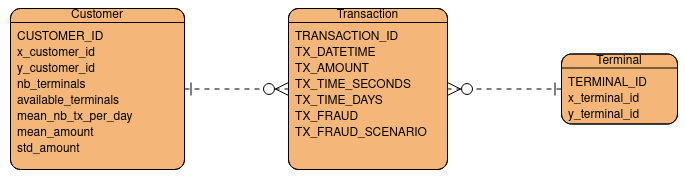

# New Generation DBMS Project 2023/2024:

For the realization of this project I have choose to use Neo4J, the choice of a Graph Database is due to the value that the relationship assumed in the considered dataset and to some of the operations that are needed.

## Models:

The simulator generate three different tables:

- **Customer**, that doesn't hold any classical information (like the name, surname, etc) about the person that it represents, but instead has a more pragmatical way of describe it with a *unique identifier*, the *geographical location*, the *spending frequency* and the *spending amounts*
- **Terminal**, that holds only the information about his *geographical location*
- **Transaction**, that connects a **Customer** and **Terminal**, holding the information about the buying action. So transaction contains the *customer identifier*, the *terminal identifier*, the *amount of the transaction*, the *date in which the transaction occurred* and an optional field that marks a **Transaction** as *fraudulent*

### Conceptual Model:

The conceptual model is pretty simple, it lists the three entities as we see them in the dataset, connecting them via relationship of (1:n) kind.

So there will be a **Customer** that can make many **Transactions** and each of them referrer to one **Terminal**.

### Logical Model:

The initial columns are the same proposed by the simulator.

### Physical Model:

In the physical model I have added the types, the primary key and the foreign keys at the logical model.

### UML Class Diagram:

### Neo4J Model:

